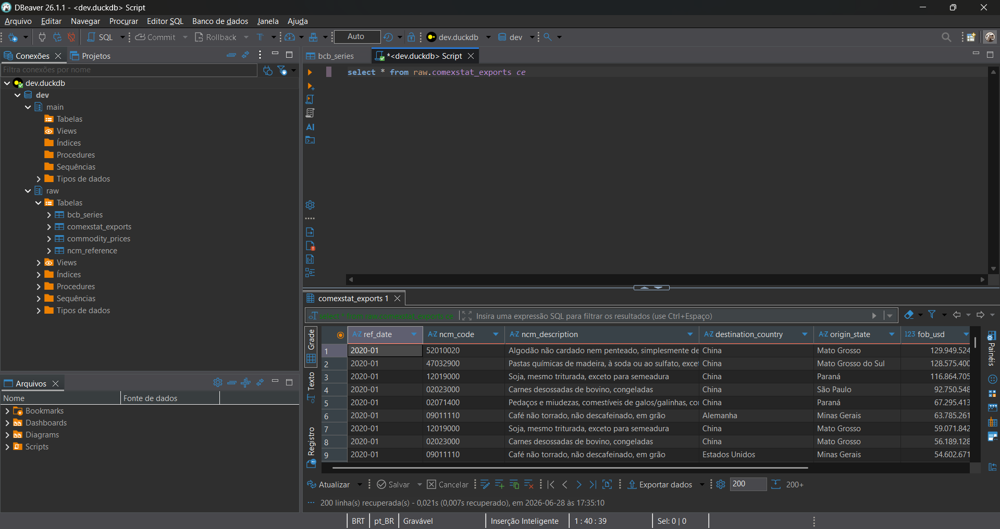
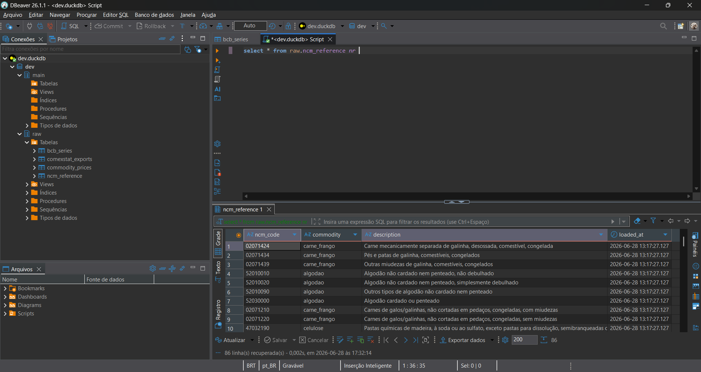
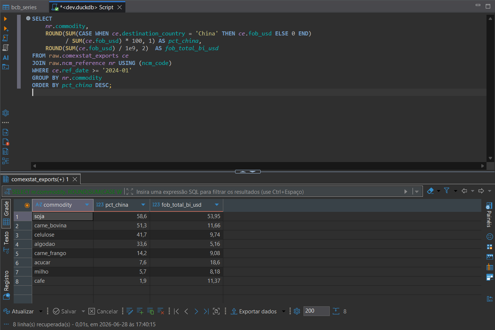

# AgriExport Intelligence

> Pipeline de analytics-engineering para exportações do agronegócio brasileiro —
> APIs públicas → DuckDB → dbt → dashboard.

---

## Pergunta de negócio

**Onde estão o risco e a oportunidade nas exportações agrícolas do Brasil?**

- **Concentração de mercado** — quão exposta está cada commodity a poucos compradores? (HHI, top-5 share)
- **Competitividade** — o preço implícito de exportação (US$/ton) acompanha o preço internacional da commodity (FRED)?
- **O que move o valor exportado** — quanto do swing FOB é *preço* vs *câmbio (USD/BRL)* vs *volume*?

---

## Status do projeto

| Etapa | Status |
|---|---|
| Camada de ingestão (EL) | Concluída |
| dbt staging | Em andamento |
| dbt marts (star schema) | Pendente |
| Dashboard | Pendente |

---

## Passo a passo — como foi construído

### 1. Definição da pergunta de negócio

Parti de uma pergunta concreta: *onde estão o risco e a oportunidade nas exportações do agronegócio brasileiro?* Isso levou a três métricas-alvo — concentração de mercado (HHI), competitividade de preço (preço implícito vs. FRED) e decomposição do swing FOB (preço × câmbio × volume).

### 2. Escolha da stack

- **DuckDB** como banco analítico local — sem servidor, arquivo único, SQL completo, lê Parquet nativamente.
- **Python** para a camada de ingestão (requests + duckdb).
- **dbt** para as transformações (staging → marts em star schema).

### 3. Ingestão de dados (camada EL)

Quatro fontes públicas, todas via API:

| Tabela raw | Fonte | Granularidade | Período |
|---|---|---|---|
| `raw.comexstat_exports` | API Comex Stat (MDIC) | mês × NCM × país × estado | 2020–2024 |
| `raw.ncm_reference` | API Comex Stat `/tables/ncm` | 1 linha por NCM | atual (86 codes) |
| `raw.bcb_series` | BCB SGS (séries 1, 432, 433) | diária / mensal | 2015–hoje |
| `raw.commodity_prices` | FRED (St. Louis Fed) | mensal | histórico completo |

**Séries BCB:** USD/BRL (cód 1), IPCA (cód 433), Selic (cód 432).

**Commodities FRED:** soja (`PSOYBUSDM`), milho (`PMAIZMTUSDM`), café (`PCOFFOTMUSDM`), açúcar (`PSUGAISAUSDM`), carne bovina (`PBEEFUSDM`).

**8 grupos de commodities mapeados:** acucar, algodao, cafe, carne_bovina, carne_frango, celulose, milho, soja.

> **Nota:** CEPEA foi descartado (Cloudflare 403 na API) e substituído pelo FRED como fonte de preços internacionais.

### 4. Exploração do banco com DBeaver

Com os dados carregados em `data/dev.duckdb`, o schema `raw` ficou disponível para exploração visual no DBeaver:

**`raw.comexstat_exports`** — dados de exportação por mês, NCM, país de destino e estado de origem:



**`raw.ncm_reference`** — tabela de referência mapeando cada código NCM ao grupo de commodity:



**Concentração de mercado — dependência da China por commodity (2024):** join entre as duas tabelas, calculando o percentual do FOB exportado para a China e o total em bilhões de USD:



Soja exportou US$ 53,95 bi com 58,6% indo para a China. Carne bovina aparece logo atrás com 51,3% de dependência — exatamente o tipo de risco de concentração que o projeto vai quantificar via HHI.

### 5. Validação da ingestão (2024)

- 48.513 linhas em `comexstat_exports`
- Soja = US$ 53,9 bi FOB
- China = US$ 46,8 bi (principal destino)
- Mato Grosso = US$ 26 bi (principal estado)

### 6. Próximas etapas

Transformações dbt (staging → marts em star schema) e dashboard analítico.

---

## Como funciona

```
APIs públicas  →  Python (ingestion/)  →  DuckDB raw  →  dbt  →  Dashboard
```

---

## Estrutura do repositório

| Pasta | O que contém |
|---|---|
| [`ingestion/`](ingestion/) | Scripts Python que puxam dados das APIs públicas |
| [`dbt/`](dbt/) | Transformações SQL: `staging/` → `marts/` (star schema) + testes |
| [`dashboards/`](dashboards/) | Arquivos de dashboard |
| [`docs/`](docs/) | Diagrama de arquitetura e modelo de dados |

---

## Quickstart

```bash
# 1. Ambiente
python -m venv .venv
.venv\Scripts\activate          # Windows
pip install -e ".[dev]"

# 2. Ingestão
python -m ingestion

# 3. Transformações dbt
cp dbt/profiles.example.yml ~/.dbt/profiles.yml
cd dbt && dbt deps && dbt build --target dev
```

### Visualizar o banco

O banco de desenvolvimento fica em `data/dev.duckdb`. Para explorar visualmente, use o **DBeaver** (dbeaver.io) apontando para esse arquivo. Para queries rápidas no terminal, use o **Harlequin** (`pip install harlequin` → `harlequin data/dev.duckdb`).

---

## Arquitetura dbt (planejada)

```
raw.comexstat_exports  ─┐
raw.ncm_reference      ─┤─►  staging  ─►  marts (star schema)  ─►  dashboard
raw.bcb_series         ─┤
raw.commodity_prices   ─┘
```

Star schema — grain: `mês × NCM × país × estado`

```
dim_date    dim_product (NCM → grupo → setor)
    |               |
    └──► fact_exports ◄──┘      fob_usd, net_weight_kg, implied_price_usd_ton
              |
         dim_country   dim_geo (estado, região BR)
```

---

## Stack

`Python 3.11` · `DuckDB` · `dbt` · `GitHub Actions`

---

## Licença

MIT — ver [LICENSE](LICENSE).
