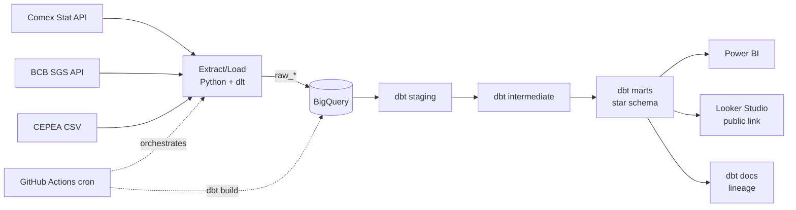

# Architecture



## Layers

| Layer | Tool | Purpose |
|---|---|---|
| Extract/Load | Python + dlt | Idempotent ingestion from public APIs into `raw_*` |
| Warehouse | BigQuery (DuckDB for dev) | Storage + compute |
| Transform | dbt | staging → intermediate → marts (star schema), tested |
| Serve | Power BI + Looker Studio | Depth + public clickable dashboard |
| Orchestrate | GitHub Actions (→ Dagster/Docker) | Scheduled refresh + CI |

## Star schema

```
        dim_date            dim_product (NCM → chain → sector)
            |                        |
            +------►  fact_exports  ◄+      grain: month × NCM × country × state
            |        fob_usd               + conformed: fact_fx, fact_prices
   dim_country       net_weight_kg
                     implied_price_usd_ton
                         |
                       dim_geo (BR state, region)
```
