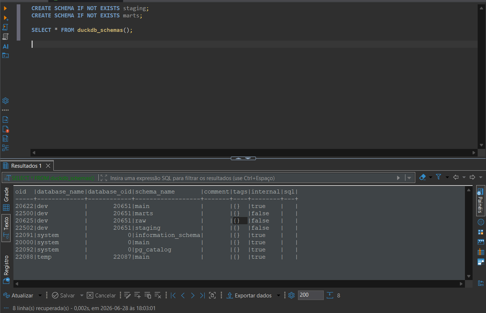
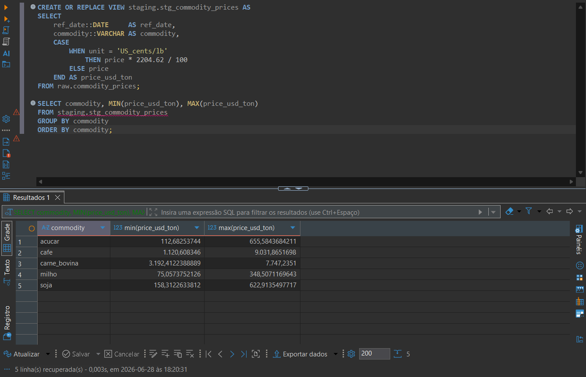
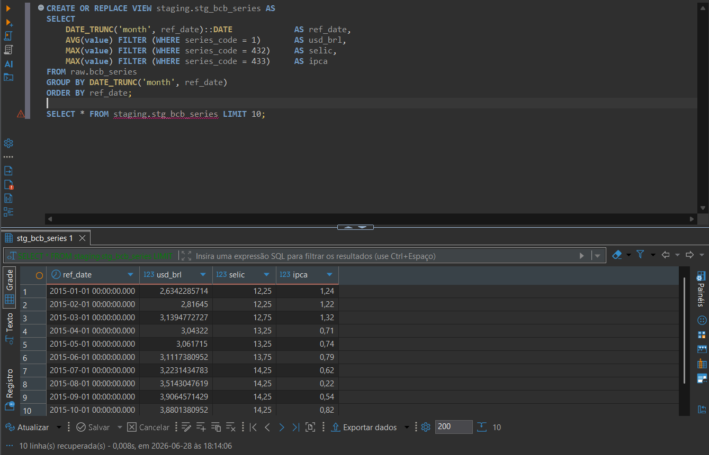

# Camada de staging — detalhe técnico

> Documento de aprofundamento. Para a visão geral do projeto, volte ao [README](../README.md).

A camada de **staging** é a primeira transformação sobre os dados brutos (`raw`). O
objetivo aqui **não** é análise — é deixar os dados *limpos, tipados e padronizados*,
prontos para serem combinados na camada de marts.

---

## Princípio: staging são VIEWS sobre o raw

Cada modelo de staging é uma **view**, não uma tabela física. Uma view é um `SELECT`
salvo com um nome: ela não armazena dados, apenas executa o SQL sobre o `raw` toda vez
que é consultada.

Isso traz três vantagens:

- **Zero duplicação** — os dados moram só no schema `raw`.
- **Sempre atualizados** — se o `raw` for recarregado, o staging reflete na hora.
- **Camada de isolamento** — se uma API mudar o nome de uma coluna, o conserto é feito
  só na view de staging; os marts e as queries analíticas continuam funcionando.

```
raw.*      (tabelas físicas — exatamente como vieram das APIs)
   │
   ▼  staging — VIEWS: renomear, tipar, normalizar unidades, pivotar
staging.*
   │
   ▼  marts — TABELAS: joins, surrogate keys, métricas derivadas
marts.*
```

---

## Setup — os três schemas

Antes dos modelos, separamos o banco em três schemas que espelham as camadas do pipeline:

```sql
CREATE SCHEMA IF NOT EXISTS staging;
CREATE SCHEMA IF NOT EXISTS marts;
-- (o schema `raw` já existe, criado pela camada de ingestão)
```



`duckdb_schemas()` confirma os três schemas do banco `dev`: `raw` (entrada),
`staging` (limpeza) e `marts` (saída analítica).

---

## Os quatro modelos de staging

| Modelo | Fonte raw | Transformação principal |
|---|---|---|
| `stg_ncm_reference` | `raw.ncm_reference` | tipagem + descarte de colunas |
| `stg_comexstat_exports` | `raw.comexstat_exports` | conversão de `ref_date` string → date |
| `stg_commodity_prices` | `raw.commodity_prices` | **normalização de unidades** → USD/ton |
| `stg_bcb_series` | `raw.bcb_series` | **pivot** long → wide + agregação mensal |

### 1. `stg_ncm_reference` — o caso trivial

A tabela de referência de NCM já vinha bem estruturada. O staging só garante os tipos
e mantém apenas as colunas úteis.

```sql
CREATE OR REPLACE VIEW staging.stg_ncm_reference AS
SELECT
    ncm_code::VARCHAR    AS ncm_code,
    commodity::VARCHAR   AS commodity,
    description::VARCHAR AS description
FROM raw.ncm_reference;
```

### 2. `stg_comexstat_exports` — convertendo a data

A maior tabela do projeto (48k+ linhas) trazia dois detalhes a tratar: `ref_date` vinha
como **string** `'2020-01'` (não uma data), e a coluna `ncm_description` era redundante
com a `stg_ncm_reference`.

```sql
CREATE OR REPLACE VIEW staging.stg_comexstat_exports AS
SELECT
    (ref_date || '-01')::DATE    AS ref_date,
    ncm_code::VARCHAR            AS ncm_code,
    destination_country::VARCHAR AS destination_country,
    origin_state::VARCHAR        AS origin_state,
    fob_usd::DOUBLE              AS fob_usd,
    net_weight_kg::DOUBLE        AS net_weight_kg
FROM raw.comexstat_exports;
```

O DuckDB não converte `'2020-01'` direto para `DATE` — ele precisa de um dia. Concatenar
`'-01'` produz `'2020-01-01'`, que faz o cast sem erro. A `ncm_description` é descartada
para evitar o mesmo dado em dois lugares (risco de inconsistência).

### 3. `stg_commodity_prices` — normalização de unidades

Este é um transform que parece pequeno mas é crítico para a análise. Os preços do FRED
chegam em **unidades diferentes** por commodity:

| Commodity | Unidade no raw |
|---|---|
| soja, milho | USD/metric_ton |
| açúcar, café, carne bovina | US_cents/lb |

Comparar preços em unidades diferentes não faz sentido. A view padroniza tudo para
**USD/ton**:

```sql
CREATE OR REPLACE VIEW staging.stg_commodity_prices AS
SELECT
    ref_date::DATE     AS ref_date,
    commodity::VARCHAR AS commodity,
    CASE
        WHEN unit = 'US_cents/lb'
            THEN price * 2204.62 / 100
        ELSE price
    END AS price_usd_ton
FROM raw.commodity_prices;
```

A fórmula `price * 2204.62 / 100` faz duas conversões: `* 2204.62` (1 tonelada =
2204,62 libras) e `/ 100` (centavos → dólares).



Depois da normalização, todos os preços ficam na mesma régua e comparáveis: café atingiu
~USD 9.031/ton no pico, açúcar ~USD 655/ton, carne bovina ~USD 7.747/ton.

### 4. `stg_bcb_series` — pivot de long para wide

O caso mais interessante. O `raw.bcb_series` está em formato **long** — uma linha por
série econômica por data:

```
series_code | series_name | ref_date   | value
1           | usd_brl     | 2015-01-02 | 2.6929
1           | usd_brl     | 2015-01-05 | 2.7107
432         | selic       | 2015-01-01 | 12.25
433         | ipca        | 2015-01-01 | 1.24
```

Para a análise, queremos formato **wide** — uma linha por mês, uma coluna por série.
Há um detalhe: `usd_brl` é **diário** (dias úteis), enquanto `selic` e `ipca` são
**mensais**. Pivotar direto deixaria a maioria das linhas com `NULL`. A solução é
agregar tudo para granularidade mensal antes do pivot — média do dólar no mês, valor
único de selic/ipca.

```sql
CREATE OR REPLACE VIEW staging.stg_bcb_series AS
SELECT
    DATE_TRUNC('month', ref_date)::DATE         AS ref_date,
    AVG(value) FILTER (WHERE series_code = 1)   AS usd_brl,
    MAX(value) FILTER (WHERE series_code = 432) AS selic,
    MAX(value) FILTER (WHERE series_code = 433) AS ipca
FROM raw.bcb_series
GROUP BY DATE_TRUNC('month', ref_date)
ORDER BY ref_date;
```

O `FILTER (WHERE ...)` é a sintaxe de pivot do DuckDB: cada agregação só considera as
linhas da série correspondente.



Resultado: de ~2.700 linhas diárias empilhadas para uma linha limpa por mês, com as três
séries lado a lado. Janeiro/2015: dólar médio R$ 2,63, Selic 12,25%, IPCA 1,24%.

---

## Próximo passo

Com o staging pronto, a próxima camada são os **marts** (star schema): `dim_product`,
`dim_country`, `dim_geo`, `dim_date` e a `fact_exports` que une tudo. Diferente do
staging, os marts são **tabelas físicas** — materializadas para consultas analíticas
rápidas.
